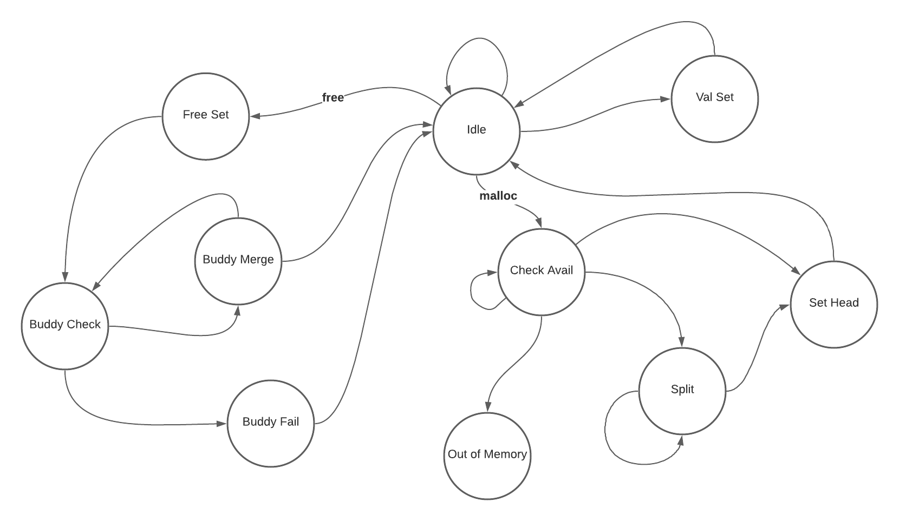

# ASCII Malloc
ASCII Malloc (amalloc) is a terminal based, interactive, 16 byte,
buddy-system memory allocator.
What does that all mean?
- **Terminal Based** - amalloc runs entirely in the terminal and
provides visuals to different actions done when allocating memory

- **Interactive** - amalloc works similarly to a REPL loop where you input
commands like
    > x = malloc(3)  
    > y = malloc(1)  
    > free(x)  

- **16 Byte** - the sum of all memory allocations,inluding meta data, is 16 bytes  

- **Buddy System** - Can't easily sum it up, but wikipedia provides a good
[summary](https://en.wikipedia.org/wiki/Buddy_memory_allocation)  

- **Memory Allocator** - a system that can dynamically set memory to be used at a 
later time. Wikipedia also has a [summary](https://en.wikipedia.org/wiki/Memory_management#ALLOCATION)

## Example

https://user-images.githubusercontent.com/39787056/116793832-2b68bc80-aa97-11eb-824c-b8b3bdd12c7d.mp4

## Install
You can build the executable
```
$ git clone https://github.com/NithinChintala/amalloc.git
$ go build
$ ./amalloc
```
Or run it as a script
```
$ git clone https://github.com/NithinChintala/amalloc.git
$ go run main.go
```

# How Does it Work?
**Header** - 1 byte
```
         used         unused
             \       /
              \   <--->
             0b011xxxxx
                ^^ 
               /
              /
            index

0b01100000 == {used: false, index: 3}
0b10100000 == {used: true,  index: 1}
```

**Cell** - 2 bytes
```
         used         prev      next
             \       /         /
              \   <--->      <--->
             0b00111111 0bxxx00100
                ^^        <->
               /           |
              /            unused
            index

[0b00111111, 0b00000100] == {used: false, index: 1, prev: 31, next: 4}
```


