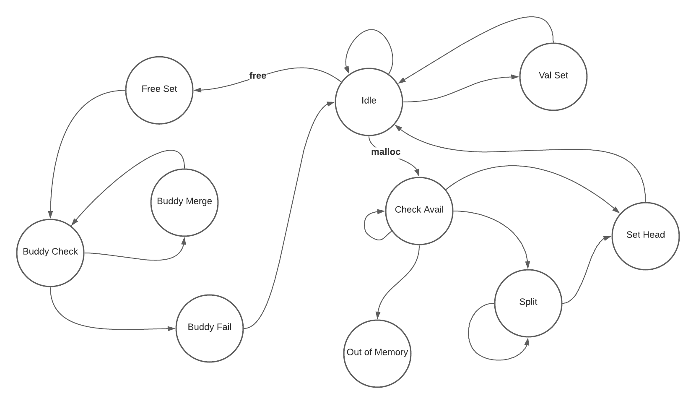

# ASCII Malloc
ASCII Malloc (amalloc) is a terminal based, interactive, 16 byte,
buddy-system memory allocator.
What does that all mean?
- **Terminal Based** - amalloc runs entirely in the terminal and
provides visuals to different actions done when allocating memory

- **Interactive** - amalloc works similarly to a REPL loop where you input
commands like
    > x = malloc(3)  
    > y = malloc(1)  
    > free(x)  

- **16 Byte** - the sum of all memory allocations,inluding meta data, is 16 bytes  

- **Buddy System** - Can't easily sum it up, but wikipedia provides a good
[summary](https://en.wikipedia.org/wiki/Buddy_memory_allocation)  

- **Memory Allocator** - a system that can dynamically set memory to be used at a 
later time. Wikipedia also has a [summary](https://en.wikipedia.org/wiki/Memory_management#ALLOCATION)

## Example


## Usage
```
usage: amalloc [-speed={step|slow|norm|fast|inst}]
  -speed The time between each frame in the animation
      step: wait for user input
      slow: wait 1.5s
      norm: wait 1.0s (default)
      fast: wait 0.5s
      inst: wait 0.0s
```
Once you are running the code the following commands are valid. To keep
the animation less crowded, variables are limited to single characters.
```
>>> <char> = malloc(<size>)
>>> free(<char>)

>>> x = malloc(4)
>>> y = malloc(7)
>>> free(x)
>>> free(y)
```

## Install
You can build the executable
```
$ git clone https://github.com/NithinChintala/amalloc.git && cd amalloc
$ go build
$ ./amalloc
```
Or run it as a script
```
$ git clone https://github.com/NithinChintala/amalloc.git && cd amalloc
$ go run main.go
```

# How Does it Work?
At a high level the code is running a Finite State Machine. Each state is
rendered in the animation and calling malloc / free alters the state of
the animation. For all the transitions see below. You always start in the
Idle state and wait for some user input. All other states go on to the 
next state based on the input speed. The animation will always show what
state is currently being rendered.



These are the ways the headers and cells are represented. The next and prev
sections represent indexes each byte in the 16 byte heap. Since it takes
4 bits to represent 16 location, a NULL pointer is represented as 11111 or
5 ones in a row.
**Header** - 1 byte
```
         used         unused
             \       /
              \   <--->
             0b011xxxxx
                ^^ 
               /
              /
            index

0b01100000 == {used: false, index: 3}
0b10100000 == {used: true,  index: 1}
```

**Cell** - 2 bytes
```
         used         prev      next
             \       /         /
              \   <--->      <--->
             0b00111111 0bxxx00100
                ^^        <->
               /           |
              /            unused
            index

[0b00111111, 0b00000100] == {used: false, index: 1, prev: 31, next: 4}
```
